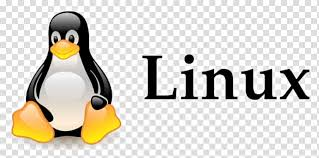

# Dónde seguir y aprender DevOps en 2026

Si estás empezando en DevOps, probablemente ya te encontraste con el primer problema del área:

No falta información. **Sobra.**

Gracias a la globaliazcion hay miles de cursos accesibles, canales de YouTube, newsletters, influencers, certificaciones, blogs, repositorios y herramientas nuevas apareciendo constantemente. Un día estás aprendiendo [Docker](https://www.docker.com/). Al otro alguien te dice que aprendas [Kubernetes](https://kubernetes.io/). Después aparecen [Terraform](https://developer.hashicorp.com/terraform), [Ansible](https://www.redhat.com/es/interactive-labs/ansible), [GitOps](https://www.ibm.com/es-es/think/topics/gitops), Observabilidad, [SRE](https://www.ibm.com/es-es/think/topics/site-reliability-engineering), Platform Engineering, [FinOps](https://www.ibm.com/es-es/think/topics/finops) y otras veinte siglas más. 

Es fácil sentirse perdido. Y es aún más fácil pasar meses consumiendo contenido sin llegar a construir absolutamente nada. En 2026, el desafío no es acceder al conocimiento, sino saber filtrar el ruido.

---

## El error más común: El "Efecto Checklist"

Mucha gente intenta aprender DevOps como si fuera una lista de supermercado tecnológica. Piensan que al tachar Docker, Kubernetes y Terraform del mapa de ruta ya son ingenieros DevOps. 

Y no, la realidad es que no funciona así. DevOps no es una tecnología; es una combinación de prácticas, automatización, colaboración y mejora continua orientada a acelerar y asegurar el ciclo de vida del software. Por eso no existe un curso mágico que te convierta en DevOps Engineer.

La mayor parte del verdadero aprendizaje ocurre cuando el entorno ideal de los tutoriales se destruye:
* Un deploy rompe producción a las dos de la mañana.
* Un backup falla justo cuando intentás restaurarlo.
* Una consulta SQL bloquea la base de datos por un índice faltante.
* Un disco de staging se queda sin espacio por culpa de logs mal rotados.
* Una pipeline de integración continua deja de funcionar porque expiró un token de acceso.

Los cursos te muestran el camino feliz, la realidad es que la experiencia aparece cuando algo falla: En mis primeros años eso significaba pasar horas deambulando por [Stack Overflow](https://stackoverflow.com/), foros y documentación buscando una respuesta. Hoy gran parte de ese recorrido puede acelerarse con inteligencia artificial.

La herramienta cambió.

Lo que no cambió es que la mejor forma de aprender sigue siendo resolver problemas reales.

---

## El mapa de ruta para 2026: Menos es más

Para no ahogarte en el ecosistema actual, es fundamental consolidar las bases antes de saltar a la última herramienta de moda en [GitHub](https://github.com/). El orden lógico sigue siendo el mismo:

1. **Fundamentos de Sistemas Operativos y Redes:** Dominar [Linux](https://training.linuxfoundation.org/) (administración, permisos, SSH, bash scripting) y entender cómo viajan los datos (TCP/IP, DNS, HTTP/S, firewalls). Sin esto, diagnosticar un error en Kubernetes es imposible.
2. **Contenedores de verdad:** No te limites a hacer `docker run`. Entendé cómo interactúa el motor de contenedores con los namespaces y cgroups de Linux, cómo persistir datos de forma segura y cómo optimizar imágenes para producción.
3. **Automatización e Infraestructura como Código (IaC):** Automatizá primero con scripts simples en Bash o Python. Cuando sientas el dolor de mantener esos scripts en diez servidores, pasá a herramientas declarativas como Terraform u OpenTofu.
4. **CI/CD como motor del cambio:** Diseñá pipelines que no solo compilen código, sino que ejecuten linters, pruebas unitarias, análisis estático de seguridad (SAST) y despliegues automatizados basados en GitOps.

---

## Estrategia de consumo: el filtro radical

En 2026, el problema ya no es encontrar información.

El problema es sobrevivir al exceso de información.

Cada semana aparecen nuevas herramientas, cursos, newsletters, podcasts, canales de YouTube y publicaciones que prometen enseñarte DevOps, Kubernetes, Cloud o Platform Engineering.

Si intentás seguir todo, terminás agotado.

Por eso recomiendo un enfoque simple: construir tu propio sistema de aprendizaje utilizando pocas fuentes, pero de alta calidad.

---

### 1. El Roadmap de Referencia (Tu brújula)

Antes de seguir personas o consumir contenido, necesitás entender cómo encajan las piezas.

Para eso sigo recomendando:

* [https://roadmap.sh/devops](https://roadmap.sh/devops)

No lo veas como una lista de tareas obligatorias, pensalo como un mapa: Te permite entender qué conceptos se relacionan entre sí y cuáles son los siguientes pasos posibles en tu aprendizaje.

Muchas veces sirve más para orientarse que para estudiar.

---

### 2. Creadores de contenido que aportan valor

No todos los canales técnicos son iguales.

Algunos enseñan tecnología, otros enseñan a hacer mini demos para YouTube.

La diferencia es importante.

#### Pelado Nerd

* YouTube: [https://www.youtube.com/@PeladoNerd](https://www.youtube.com/@PeladoNerd)
* Web: [https://peladonerd.com](https://peladonerd.com)

Uno de los mejores creadores de contenido técnico en español: Explica Linux, Docker, Kubernetes, redes e infraestructura de forma práctica y sin vueltas.

Ideal para quienes vienen del mundo de sistemas y operaciones.

---

#### TechWorld with Nana

* YouTube: [https://www.youtube.com/@TechWorldwithNana](https://www.youtube.com/@TechWorldwithNana)
* Web: [https://www.techworld-with-nana.com](https://www.techworld-with-nana.com)

Probablemente una de las referencias más conocidas del ecosistema DevOps.

Excelente capacidad para explicar conceptos complejos de forma visual y accesible.

Muy recomendable para:

* Docker
* Kubernetes
* CI/CD
* GitOps
* Prometheus
* Cloud Native

---

#### NetworkChuck

* YouTube: [https://www.youtube.com/@NetworkChuck](https://www.youtube.com/@NetworkChuck)

Contenido dinámico y muy orientado a laboratorios.

Ideal para despertar curiosidad y comenzar a experimentar con:

* Linux
* Redes
* Docker
* Seguridad
* Homelab

No siempre profundiza técnicamente, pero suele ser un excelente punto de entrada.

---

### 3. Personas que vale la pena seguir

Las herramientas cambian.

Las buenas ideas suelen permanecer.

Por eso también conviene seguir a quienes ayudan a definir la industria.

#### Gene Kim

* X: [https://x.com/RealGeneKim](https://x.com/RealGeneKim)

Autor de:

* The Phoenix Project
* The DevOps Handbook

Gran parte de las prácticas modernas de DevOps tienen relación directa con sus trabajos.

---

#### Jez Humble

* X: [https://x.com/jezhumble](https://x.com/jezhumble)

Coautor de Continuous Delivery.

Una referencia obligatoria para entender despliegues continuos, automatización y calidad de software.

---

#### John Willis

* X: [https://x.com/botchagalupe](https://x.com/botchagalupe)

Uno de los referentes históricos del movimiento DevOps.

Muy activo compartiendo experiencias y conceptos relacionados con operaciones y cultura organizacional.

---

### 4. Comunidades donde realmente se aprende

Los cursos enseñan.

Las comunidades responden preguntas reales.

Reddit sigue siendo una de las mejores fuentes para leer experiencias de producción.

* [https://reddit.com/r/devop](https://reddit.com/r/devops)
* [https://reddit.com/r/sre](https://reddit.com/r/sre)
* [https://reddit.com/r/kubernetes](https://reddit.com/r/kubernetes)
* [https://reddit.com/r/terraform](https://reddit.com/r/terraform)
* [https://reddit.com/r/aws](https://reddit.com/r/aws)
* [https://reddit.com/r/azure](https://reddit.com/r/azure)
* [https://reddit.com/r/homelab](https://reddit.com/r/homelab)
* [https://reddit.com/r/selfhosted](https://reddit.com/r/selfhosted)

Muchas veces vas a aprender más leyendo un post sobre un incidente real que mirando diez videos teóricos.

---

### 5. La documentación oficial (La fuente de verdad)

Tarde o temprano todos terminamos llegando aquí.

La documentación oficial es donde realmente vive el conocimiento actualizado.

Algunas referencias fundamentales:

* Docker: [https://docs.docker.com](https://docs.docker.com)
* Kubernetes: [https://kubernetes.io/docs](https://kubernetes.io/docs)
* Terraform: [https://developer.hashicorp.com/terraform/docs](https://developer.hashicorp.com/terraform/docs)
* PostgreSQL: [https://www.postgresql.org/docs](https://www.postgresql.org/docs)
* Git: [https://git-scm.com/doc](https://git-scm.com/doc)

Cuando aprendés a leer documentación técnica, dejás de depender de tutoriales que pueden quedar obsoletos en pocos meses.

Es una habilidad que vale más que cualquier curso puntual.

---

## Entonces, ¿qué conviene hacer hoy?

La recomendación es simple: **Consumir menos contenido y construir más.**

Por cada hora que dediques a leer o mirar videos, intentá dedicar al menos otra hora a probar algo en un entorno real. El consumo pasivo genera una falsa sensación de competencia que desaparece al abrir la terminal.

Armá tu propio laboratorio local o usá capas gratuitas en la nube para experimentar:
* Creá una máquina virtual desde la terminal.
* Levantá un contenedor y configuralo para que inicie automáticamente con el sistema.
* Automatizá una tarea repetitiva con un script que capture errores y genere logs con timestamps.
* Configura un sistema de monitoreo básico que te avise cuando el uso de CPU supere el 80%.
* Documentá cada paso en un archivo Markdown dentro de un repositorio de Git.

Cualquier cosa que te obligue a tocar la tecnología con tus propias manos y a enfrentarte a un mensaje de error es útil. Ahí es donde realmente se aprende DevOps.